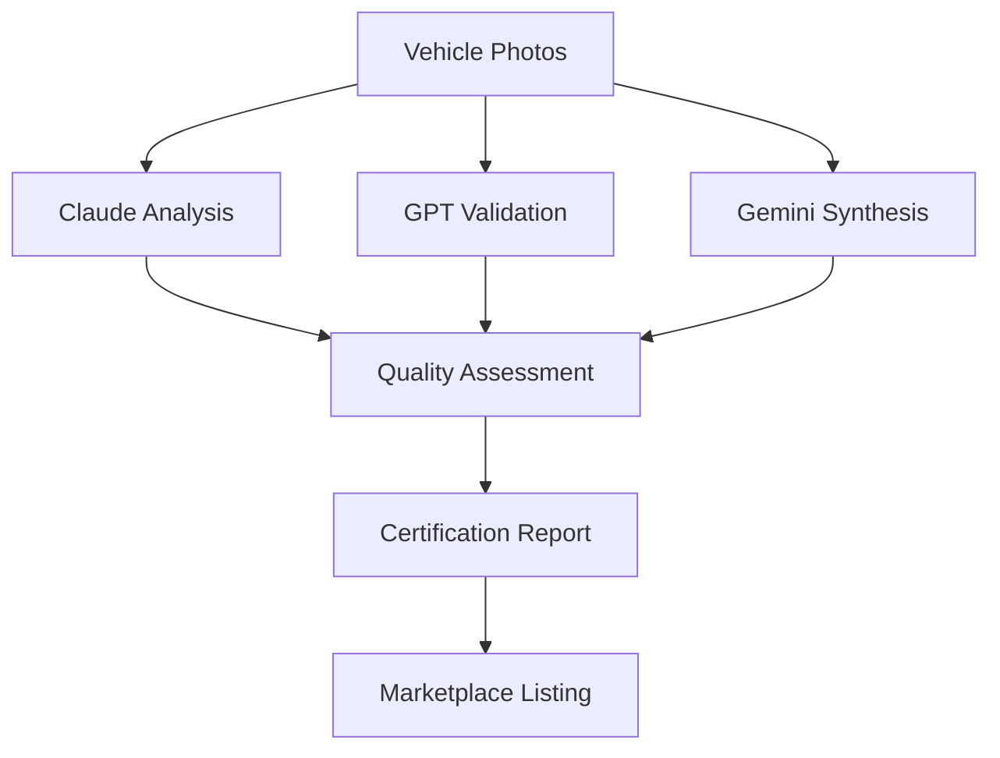

# nature-office Architecture Documentation

## Overview

`nature-office` is a comprehensive platform for AI-powered vehicle certification and mobile office marketplace management. Built on Alberta's robust AI ecosystem, it provides a standardized approach to assessing office-readiness for mobile workspaces.

## System Architecture

### Core Components

```
📦 nature-office/
├── core/
│   ├── __init__.py        # Core package exports
│   ├── agy_bridge.py     # Vehicle assessment interface
│   └── policy.py         # Certification criteria & configuration
├── tooling/
│   └── scripts/          # Command-line tools
├── docs/                 # Documentation & guides
├── tests/               # Test suites
├── requirements.txt     # Dependencies
└── setup.py             # Package configuration
```

### Technology Stack

#### Backend Services
- **Python 3.10+** - Primary development language
- **AI Integration** - Claude, GPT, Gemini via agy integration
- **Web Framework** - FastAPI for API services
- **Database** - SQLAlchemy with SQLite/PostgreSQL
- **Authentication** - JWT-based security

#### Infrastructure
- **Docker** - Container orchestration
- **Kubernetes** - Scalable deployment
- **GitHub Actions** - CI/CD pipelines
- **Monitoring** - Prometheus + Grafana

#### Client Applications
- **CLI Tool** - `nature-cli` for vehicle assessment
- **Web Dashboard** - Admin interface for marketplace management
- **Mobile App** - Customer booking and management

## System Design

### 1. Vehicle Assessment Pipeline



#### Assessment Pipeline Components

| Stage | AI Model | Purpose | Output |
|-------|----------|---------|--------|
| **Claude Analysis** | Claude Sonnet 4.6 | Visual inspection of vehicle photos | Feature detection, quality indicators |
| **GPT Validation** | GPT OSS 120B | Technical specification validation | Pillar compliance scores |
| **Gemini Synthesis** | Gemini 3.8 Flash | Final assessment integration | Complete certification report |

### 2. Certification Criteria

#### 5-Pillar Assessment System

| Pillar | Weight | Minimum Score | Key Requirements |
|--------|--------|---------------|------------------|requirements |
| **Power** | 20% | 4/20 | Solar panels, battery system, inverter, shore power |
| **Connectivity** | 20% | 4/20 | Starlink/5G, external antenna, redundancy |
| **Workspace** | 25% | 4/25 | 2+ workstations, client seating, ergonomic setup |
| **Climate** | 20% | 4/20 | Heating/AC, insulation, temperature control |
| **Rest** | 15% | 4/15 | Dedicated sleeping area, privacy, charging |

#### Certification Tiers

| Tier | Total Score | Multiplier | Daily Rate Range |
|------|-------------|------------|------------------|
| **Executive** | 90–100 | 2.0× | $600–$800/day |
| **Professional** | 75–89 | 1.6× | $400–$550/day |
| **Office** | 60–74 | 1.3× | $250–$350/day |
| **Basic** | <60 | 1.0× | Not certified |

### 3. Data Model

#### Vehicle Assessment
```json
{
  "vehicle_id": "VT001",
  "assessment_id": "assess_VT001_1234567890",
  "timestamp": "2024-09-23T02:18:00Z",
  "visual_assessment": {
    "photo_count": 4,
    "detected_features": {...},
    "quality_indicators": {...},
    "compliance": {...}
  },
  "technical_validation": {
    "pillar_scores": {
      "power": 18,
      "connectivity": 18,
      "workspace": 22,
      "climate": 18,
      "rest": 10
    },
    "total_score": 86,
    "tier": "Professional",
    "validated_at": "2024-09-23T02:18:00Z"
  },
  "assessment": {
    "vehicle_id": "VT001",
    "total_score": 86,
    "tier": "Professional",
    "pillar_scores": {...},
    "multiplier": 1.6,
    "recommendations": [...],
    "assessment_completed_at": "2024-09-23T02:18:00Z"
  },
  "tier": "Professional",
  "multiplier": 1.6,
  "pillar_scores": {...},
  "recommendations": [...]
}
```

### 4. API Endpoints

#### Vehicle Assessment
```bash
# Assess a vehicle
curl -X POST https://api.nature-office.com/v1/assess \
  -H "Content-Type: application/json" \
  -d '{"vehicle_id": "VT001", "photos": ["photo1.jpg", "photo2.jpg"], "specs": {...}}'
```

#### Marketplace Operations
```bash
# List certified vehicles
curl -X GET https://api.nature-office.com/v1/vehicles? tier=Executive

# Book a vehicle
curl -X POST https://api.nature-office.com/v1/vehicles/VT001/book \
  -H "Authorization: Bearer <token>" \
  -d '{"start_date": "2024-10-01", "end_date": "2024-10-10"}'
```

## Security Architecture

### Authentication & Authorization
- **JWT tokens** for API authentication
- **Role-based access control** for different user types
- **API key management** for third-party integrations

### Data Security
- **Encryption in transit** (TLS 1.3)
- **Encryption at rest** (AES-256)
- **Regular security audits** and penetration testing
- **GDPR compliance** for EU customers

### Compliance
- **Alberta privacy regulations**
- **Canadian AI ethics guidelines**
- **Vehicle certification standards**
- **Environmental compliance**

## Scalability

### Horizontal Scaling
- **Load balancing** across multiple nodes
- **Auto-scaling** based on demand
- **Stateless services** for easy scaling

### Data Scaling
- **Distributed database** for high availability
- **Caching layer** for performance optimization
- **Backup and recovery** strategies

### Geographic Distribution
- **Multi-region deployment** for latency optimization
- **Edge computing** for real-time processing
- **Content delivery network** for static assets

## Monitoring & Observability

### Metrics
- **Application performance metrics**
- **Business metrics** (bookings, revenue, user growth)
- **Infrastructure metrics** (CPU, memory, network)

### Logging
- **Structured logging** with correlation IDs
- **Centralized logging** for distributed systems
- **Log retention policies** for compliance

### Alerting
- **Health checks** for critical services
- **Performance alerts** for resource utilization
- **Business alerts** for revenue anomalies

## Development Workflow

### Git Operations
```bash
# Branch strategy
git flow feature/<issue-number> develop

# Pull request templates
# CI/CD integration
# Automated testing
```

### Testing Strategy
- **Unit tests** for individual components
- **Integration tests** for service interactions
- **End-to-end tests** for user workflows
- **Performance tests** for load scenarios
- **Security tests** for compliance

## Deployment

### Local Development
```bash
# Install dependencies
pip install -r requirements.txt

# Run development server
alternatives:
  - Docker compose up -d
  - python -m nature_office.core.agy_bridge
```

### Production Deployment
```bash
# Build and deploy Docker image
docker build -t nature-office .
docker-compose -f docker-compose.prod.yml up -d
```\n
## Future Roadmap

### Phase 1: MVP (Months 1-6)
- Basic vehicle assessment functionality
- CLI tools for users
- Internal certification workflows
- Alberta market focus

### Phase 2: Scale (Months 7-12)
- Expand to other Canadian provinces
- Add mobile app for customers
- Integrate third-party payment systems
- Advanced AI model integration

### Phase 3: Platform (Months 13-24)
- Marketplace ecosystem development
- Partnership APIs for vehicle owners
- Analytics and reporting platform
- International expansion

## Team Structure

### Technical Team
- **Backend Developers** (Python, Go)
- **Frontend Developers** (React, Vue)
- **DevOps Engineers** (Kubernetes, Docker)
- **AI/ML Engineers** (Model training, integration)

### Business Team
- **Product Managers** (Feature development)
- **UX/UI Designers** (User experience)
- **Marketing Specialists** (Go-to-market strategy)
- **Sales Engineers** (Customer success)

### Operations Team
- **Infrastructure Engineers** (Cloud infrastructure)
- **Quality Assurance** (Testing, monitoring)
- **Customer Support** (24/7 service)
- **Security Team** (Compliance, audits)

## Conclusion

`nature-office` represents a comprehensive solution to the mobile office marketplace challenge. By leveraging AI-powered vehicle assessment and a robust certification system, we provide a trusted platform for connecting vehicle owners with AI professionals and government agencies needing mobile office solutions.

The architecture is designed for scalability, security, and ease of maintenance, ensuring long-term viability in a rapidly evolving market.

---

**Key Differentiators:**
1. **AI-powered certification** with 5-pillar assessment
2. **Alberta-specific focus** with government partnership opportunities
3. **Scalable architecture** for national expansion
4. **Compliance-ready** with industry-standard security
5. **User-friendly** CLI and web interfaces

**Strategic Value:**
- Address Alberta's growing AI industry needs
- Create new revenue streams for RV owners
- Provide professional mobile office solutions
- Build sustainable partnership ecosystem
- Drive economic growth in Alberta's tech sector